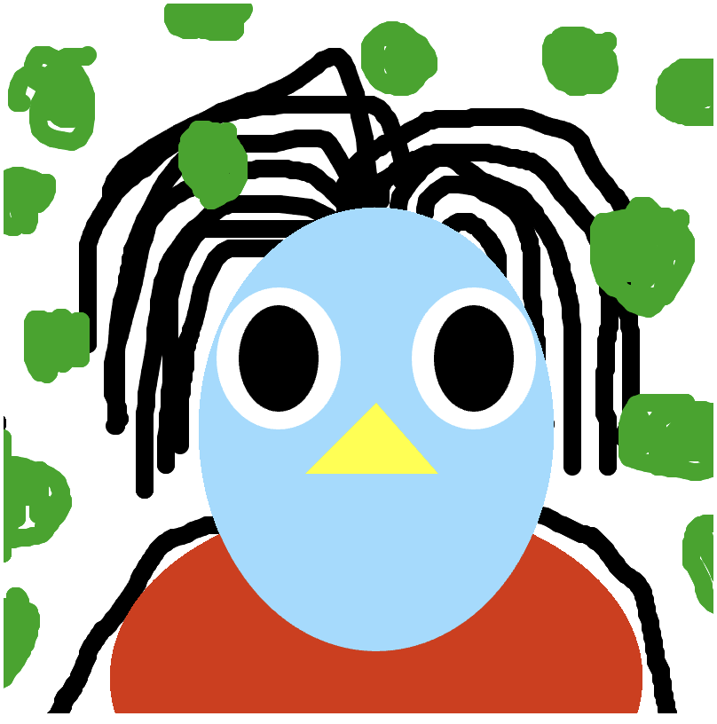

# Art Jam Response

Responses by Amanda Stormyr. 
Thanks for letting me look at your creative work. It was really fun!  

## Arielle Wong – 'Ari and the Soup' 

Hi Arielle,  
Your self-portrait is very cute and fun. It’s such a simple idea with the glasses steaming up, but it gives me a real sense of what it’s like being you. I imagine you love a hot bowl of soup, curled up on the couch with a blanket, orange and red leaves outside your window, about to watch your favorite show, but your glasses keep fogging up from the steam.

Your avatar is also super cute. It’s simple but really effective in how you added the bangs on one side. That little detail breaks the symmetry and gives the character so much life, so it doesn’t just feel like mirrored shapes.
The color palette is warm and soft, which gives me that cozy feeling right away. Having the soup bowl in blue works really nicely too, because it pops against all the warm tones and immediately draws my eye to it.

The clicking sound effect for the bowl works great. It makes me, as a player, feel like I’ve picked something up and put it back down. I would just suggest lowering the volume a bit, because since there are no other sounds, it is very loud if someone has their volume high (especially on headphones).

The outline that appears when hovering over the soup is also a nice touch. It tells me there’s something to interact with. 

The steam effect on the glasses works really well too. It’s smooth and reads clearly once you notice it. I might just make the steam appear a little faster. To be honest, I only discovered it after reading your README, which might just be me, but because nothing else changes right away when moving the mouse, I didn’t realize something was happening at first.
Maybe you could add one or two more small sounds. For example, if there was a soft “Mmm, yummy” sound when the soup is near the face, it would make it feel like the avatar is reacting.
You could also add a bit of ambient sound to set the mood, like a crackling fire or a TV show playing quietly in the background. That would help make the “click” sound less harsh and give a fuller sense of the environment. It’s a simple but powerful way to suggest a lot without adding visuals, using sound as part of the setting for your self-portrait.

You did such a great job. It really feels like I got to know a bit more about you through this piece.

## Aydan Mc Grail – 'Death By Boredom'

Hi Aydan,
Nooo… your code isn’t working… and honestly, that really bummed me out because I was so curious about your design and the functions you were using. 
First of all, I totally get it. It took me an entire day to figure out how to preload images into JavaScript, so I really appreciate your effort here.
Looking through your code, I noticed this part:

bottomImg = loadImage('/assets/images/glow_real.png') //glow image  
topImg = loadImage('/assets/images/star_real.png') //star image  
bgImg = loadImage('/assets/images/normandie_lena.png') //bg sea

It seems like those files don’t exist in your image assets folder. There’s only one PNG there called bee.png, so that might be one of the reasons the project isn’t loading properly.

Aside from that, I’m really excited to see your self-portrait because your code looks super fun and creative with the different layers of images, a rotating star and music when I am clicking the mouse botton. Can’t wait!

I also really appreciate the way you added comments in your JavaScript file, not only describing the different functions but also reflecting on your process. It might technically be “cleaner” to document that journal-style in your GitHub commits, but personally, I really enjoy reading it right there in the code. It helps me understand your thought process and makes it easier to follow, especially as someone who’s still learning.

## Jordan Jordan Lobasso – 'Character color customization'

Hi Jordan,
First of all, your self-portrait is really fun. I’m a big fan of Windows Paint. Me and my best friend used to spend hours taking turns making drawings in Paint while listening to ‘No Doubt’. So I felt both entertained and a bit nostalgic playing your game.

Design wise, the first thing that caught my eye is that there’s no margin on the left side between the sliders and the edge of the screen. I would spend a bit of time thinking about the design as a whole, because right now all the squares and rectangles feel a little crowded, and arranging them so the overall composition feels more balanced would make a big difference. The sliders and knobs are also part of your portrait. If they aren’t visually adjusted to fit the rest of the composition, they can feel a bit like they were just copy pasted in without personal styling or reflection.

I also find it really interesting that your self-portrait is a black silhouette that you invite the player or viewer to shape however they want. I think you’re onto something interesting here, questioning what a “self-portrait” even is, since we can only understand others through our own lens and experiences. It feels like you’re exploring identity and perception in a playful way, and I think that concept could be pushed even further.

About the title, I think if you added a creative twist so it doesn’t just describe the functionality but connects more to the idea of self-portraiture, it could add depth and make the piece feel more personal. Something that hints at your concept or emotion behind it would pull the player in more.

Another thing I found myself wishing for was an undo function. Although, I also see how not having one could make sense as part of the creative experience. Maybe there’s a reason why the player can’t undo, maybe it ties into how identity and expression can’t be reversed once they’re made visible. I’d just love to understand your decisions a little better in that regard.

Overall, I think you have a really solid foundation for something that could become quite existential and interesting through your design choices. If you refine the layout and visual balance, and make the elements feel more intentional, you could really emphasize that mysterious color-changing silhouette. Who is this figure? Is it you, or a reflection of whoever interacts with it? The ambiguity makes me want to know more, especially if I can sense that you’ve been reflecting on those questions while creating it.

> 