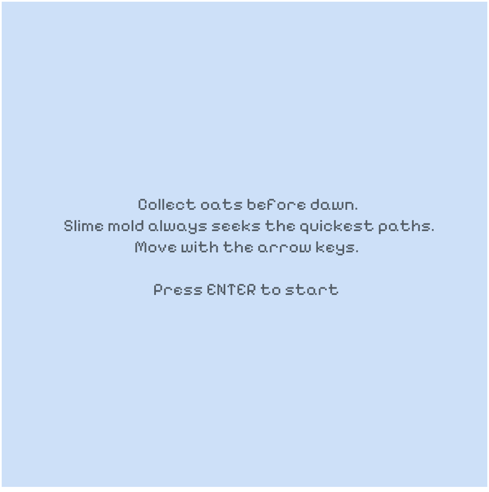
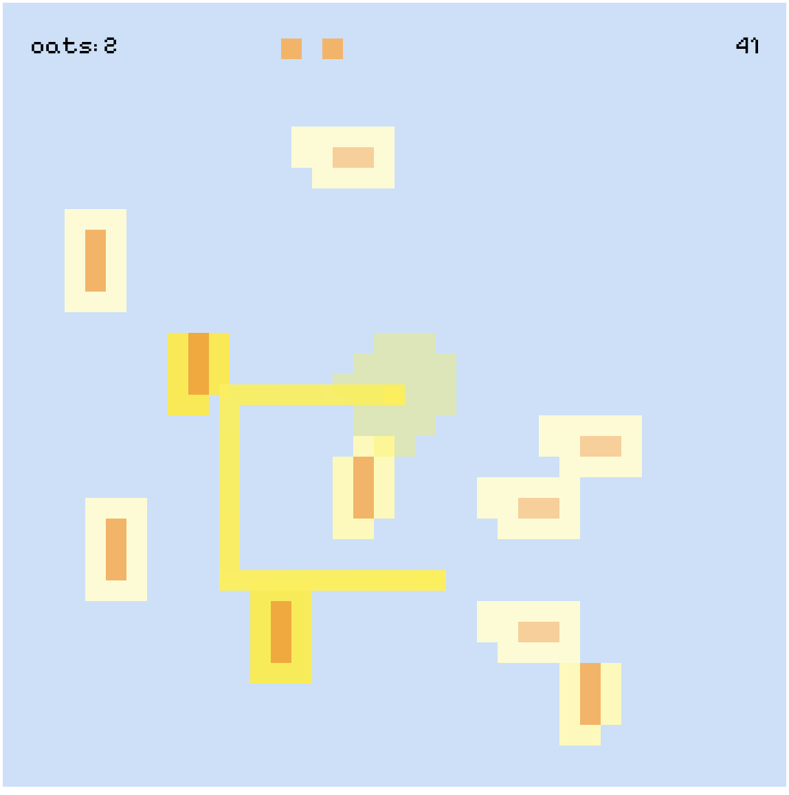
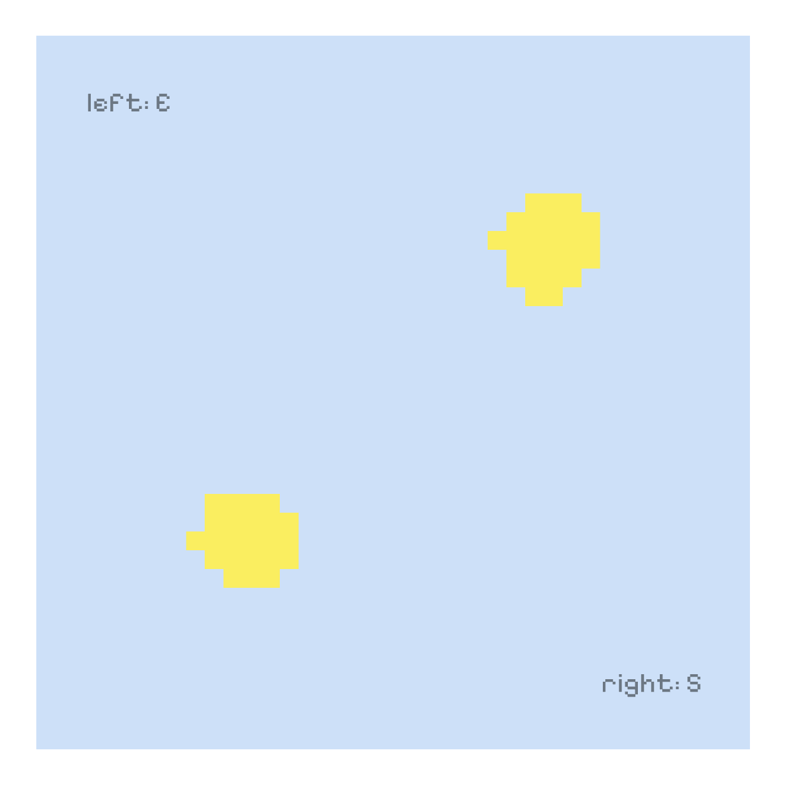
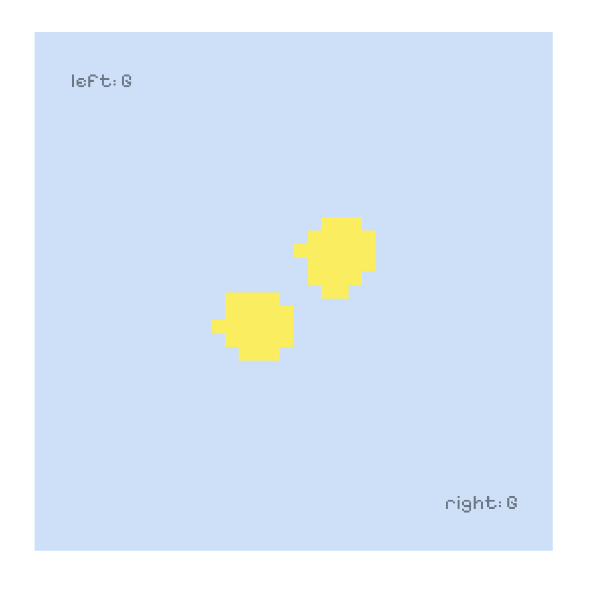
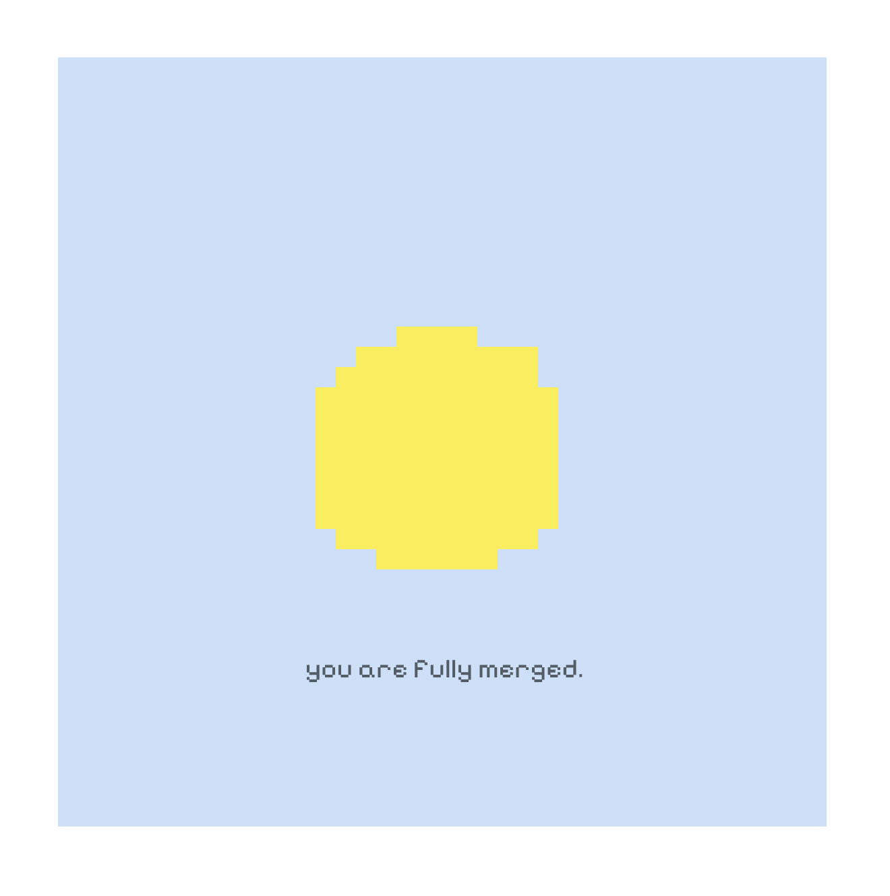

# Dormant. Forage. Oscillate. Repeat.  
AM Stormyr  
(CART 253 Variation Jam)

---

## Live Log

Follow the ongoing slime-mold research, cultivation notes, and installation experiments:  
https://am-stormyr.github.io/slime-mold-log/

---

## Description

**Dormant. Forage. Oscillate. Repeat.** is a series of three small games inspired by my semester-long work with *Physarum polycephalum*, somatic practice, performance, and electronic arts.

This project grew from the question:

**What would it feel like to sense, think, and move like slime mold?**

Throughout the semester I cultivated Physarum, documented its behaviors, built a Slime Mold Oracle Machine with Arduino, and created performances about oscillation, breath, and merging. All of this shaped the logic and atmosphere of each variation.

Each game explores a different mode of slime-mold existence: slowing down, seeking food, or pulsing toward another body.

Right now the (game) timescales are short and human for demonstration. In the future I want these games to be played in non human slime-mold time:

- Dormancy that lasts ten to twenty four hours  
- Foraging slowed into puzzle  
- Oscillation stretched across long rhythmic cycles  

Think of these versions as prototypes toward that direction.

---

## The Variations

### ⏀ DORMANT  
A game about slowing down until you shift into slime time.  
Hold **OPTION + CONTROL** without letting go.  
Release too early and your slime wakes up.  
Release never, and you drift fully into dormancy.

**Screenshot:**  

---

### ⏁ FORAGE  
You are a pseudopod seeking oats before dawn.  
Move with the **arrow keys**, collect oats, and leave a physarum trail (like they do).  
Oats rearrange themselves.  
Your slime mold always looks for the shortest route.

**Instructions Screenshot:**  

**Gameplay Screenshot:**  

---

### ⏈ OSCILLATE  
A two player merging ritual.
Both players press the prompted keys.
Each press moves the blobs closer until they merge into one pulsing organism.

Physarum (slime mold) moves through oscillation. It is a single-cell organism that contracts and expands about once per minute. That rhythm is fast for a single cell, but to humans it looks like complete stillness.

When two Physarum bodies touch, they eventually merge into a single organism. Their pulses influence one another and settle into a shared rhythm over time.

**Screenshots:**  
  
  

---

## Based On

This project began from Pippin Barr’s Variations Menu Template:  
https://pippinbarr.com/cart253/assignments/variation-jam/

---

## Assets

### Visuals  
All pixel sprites created using:  
https://make8bitart.com/

### Audio  
Synth oscillations created using:  
https://musiclab.chromeexperiments.com/Oscillators/

Slurp sound:  
Cartoon Slurp by lil_slugger  
https://freesound.org/people/lil_slugger/sounds/759264/

### Fonts  
**Pixelify Sans** for all game text.

---

## Controls

### DORMANT  
- Hold **OPTION + CONTROL**  
- Release too early → game over  
- Press **ESC** to return to menu

### FORAGE  
- Move with **Arrow Keys**  
- Collect oats before dawn  
- Press **ENTER** to start  
- Press **ESC** to return to menu

### OSCILLATE  
- Two players  
- Press the keys shown on screen  
- Merge to win  
- Press **ENTER** to start  
- Press **ESC** to return to menu

---

## Context and Inspiration

This project comes from:

- growing and observing *Physarum polycephalum*  
- building an Oracle Machine using Arduino and sensors  
- documenting Physarum’s growth patterns  
- somatic movement research around breath, oscillation, and slowness  
- performance work exploring merging and attention  
- thinking about non human temporality and how bodies sense the world  

Physarum has been a collaborator in my art practice this semester.  
Its way of thinking through pulsation, descisions, and branching networks influenced how I wanted this game to be experienced.

I have also been inspired by artists who think with living systems.  
James Bridle’s **Server Farm** is a strong reference for thinking about multispecies time, communication, and the infrastructures we share:  
https://serverfarm.jamesbridle.com/#presentation

---

## Attribution

### Libraries  
- p5.js  
- p5.sound.js

### Academic and Artistic References  
- Bonnie Bainbridge Cohen  
- Erin Manning — *The Minor Gesture*  
- James Bridle — *Server Farm*  

### Starting Template  
Variations Menu by Pippin Barr

---

## Thanks and Transparency

Thank you to:

- Pippin Barr for the template, guidance, and teaching  
- Claude for debugging support  
- Eric Campbell for oscillation research, collaboration, and general slime energy  
